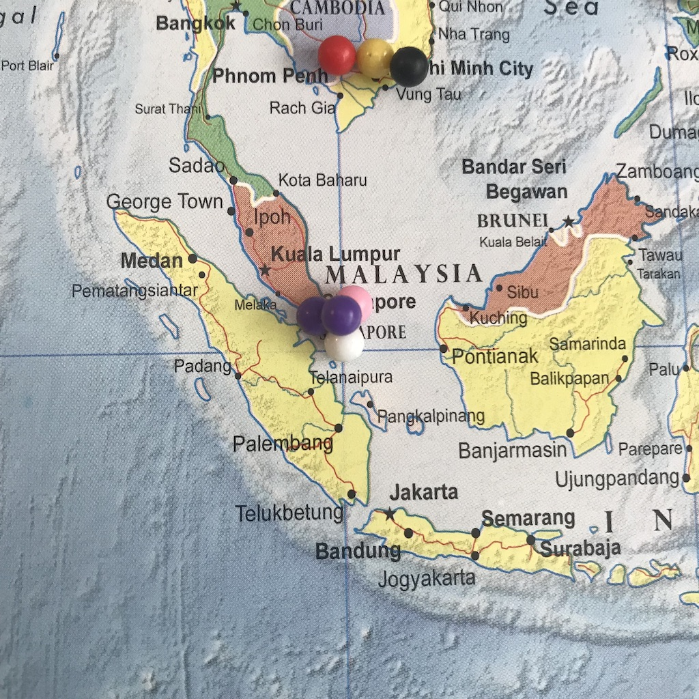

# Joe’s Valley

This is a personalized study notes of _Joe's Valley_. I am a software engineer visiting SLC for React Rally this August. Off the time of my coding I am also a climber. Long story short this is how I decided on and started the study of this trip.

I wish this set of notes will help myself throughout this trip and hopefully more people like me in the future.

I did not include the source of friends / gyms I got help from in this writeup for I am personally quite private and I extend the assumption here. If anyone I mention here would prefer a reference, please let me know and I am more than happy to add you to the list :) :)

# To Begin With...

As a climber I am doing 6b's on lead, and V3/4's on bouldering. With a recent focus on bouldering, Joe's Valley is such an interesting spot to experience. I have no prior experience for outdoor bouldering so this study notes will come from that perspective -- basics, safety, trip preparation, etc.

> I will mark most of my subjective thoughts like this.

## Words of Advice from Senpais

I talked to a few people regarding how to boulder outdoors and here are some valuable tips that I learned:

- Spotters are important. Climb with good partners who care about what you are doing.
  > I definitely agree with this throughout my other climbing. But due to the nature of this trip, I'll make friends along my way.

- Find the easiest boulders with good landing to begin with.
  > This motivates one of the following sections. I put an effort in trying to find those easy problems with good landing.

- I would probably not begin with somewhere like bishop, where the boulders are really high, even if it is very well-known.
  > OK, fair enough. I was hella scared the first time I did outdoor sport climb as well. I definitely would not go somewhere that high.

## Silly Questions of Mine

- Should I look for a way down first before climbing up every boulder?
  > My later self: Yes you should!!! Climb the downclimbs for each boulder before climbing the difficult ones!!! And put a crashpad beneath it!!! If there's a tree, use it!!!

- How tall is Isaac Caldiero (author of the guidebook)?

# Bouldering at Joe's By Region

~a.k.a. guidebook reading~

I found two sources of guides for Joe's Valley. One is a guidebook (see book reference #1) I borrowed from a friend, a route setter / gym manager at one of our local gyms, also a v10 or plus climber, who happens to have climbed at Joe's Valley a few years back. The other one is drtopo's free guide, which can be downloaded [here](http://www.drtopo.com/north-america/united-states/utah/joe-s-valley).

As I read the two guides side by side, I found it very helpful to try to match the descriptions from the two guides. With this problem-solving and/or fact-finding approach it absorbs me quite effectively, making it easy to get familiar with the material and the surrounding it's describing.

The two materials also complements each other very well as in the book contains pictures of the boulder, I can see whether it has a safe landing. The book's description of the beta is also in more detail. I can get a fairly good understanding what kind of boulder problem it is, so that I might (or not) have a rough idea whether it fits my style or not.

On the other side, the printed guides I would just feel free to write and mark anything on it. The drtopo's guide contains fewer problems (but perhaps those are the highlights) than the book. I put the page mark beside each problem. If it's something below V3 with a seemingly safe landing, I highlight it with a marker.

I am going there at a fairly hot season (mid of August). So I also try to figure out which side the boulder is facing and whether it has shades.

## Left Fork

I found [this corporate map](https://www.google.com/maps/d/u/0/edit?mid=16hbyMTTFuIlw7e6DllSHZ2Z95edmI8y-&ll=39.30773061616799%2C-111.11517843301266&z=17) very helpful to have marked _to the details to boulders_ of Joe's. And it's very updated. 
Here's the screenshot for the left fork:

**Riverside Boulders**

**K-Town**

This is perhaps the most classic, mostly visited, area of Joe's Valley. 

**K-Town: The Angler (V2???)**

> _The Angler_, of course, is one of the classics of Joe's Valley. The scene of this big boulder sitting on the fast running water is just beautiful. On any source of guides it is marked as a V2. Unfortunately this has definitely raised because the beginning is very polished now. This beginning is also the crux of the route, you need to step on to a (polished) thin edge. Personally I start with a palm on a jug-gish sloper, step on the edge, step up with a little bit of swing, and catch the left hand slopey jug. The whole move requires quite a bit of contact strength and the catch is also a bit shouldery.
> So yeah the tip for the day is to bring good edging shoe, try it before the skin is worn out. 
> Honestly, though, if I cannot get past the launch it's a bit boring..

**K-Town: Shit (V4)**

So on the right of the most well-known Angler, there are quite a few interesting slabs on this other side of the boulder. Starting from left to right are their names on the following chart.
Looking up YouTube videos I feel there are quite some confusions regarding which one is which. I am also not 100% certain, so it is with the other climbers I met at the boulder (probably because the guidebook is so rare and out of date now). Anyway, I believe that _the one that starts with tiny crimps_ is _Shit (V4)_, because this area of the boulder is covered with a bunch of shit, like tiny granite-feel sharp dried-glue-like stuff. Some of the tiny crimps and edges are among those shit too. I also believe this is indeed a V4. It's quite hard even just to start, and reading the other _shit_ along the route it's just not easy. [Here](https://www.youtube.com/watch?v=jP_nf8m-tYs) is a video for it, and they think it's _K-Town_. (Another video even think this is _B-Town_ which is supposed to be even one more to the right.)

**K-Town: K-Town (V4)**

The one on the right of _Shit_ is supposed to be K-Town. 
> Agreed to be the easiest problem in here, it is a slab problem with fairly generous holds. The beginning is a bit tricky, people do all kinds of different things. After reaching a pushed-in disk shaped thin edge, it may not seem obvious because the disk is quite thin but it does become easier. Just stand up on that thing and you're done.

> If we talk about grades, and if the one on the left is a V4, then this one should be a V3.

**K-Town: Downclimb (V0)**

A lot of people (including me) need help on this downclimb. It refreshed my understanding of V0's lol. Anyway. 
> It seems that the trick is just to make small descending foot movements on a few edges and slopers. The palmdown on the final sloper is kind of cool.

**Kelly's Rock**

This is a very special boulder near the river. It is huge and wide on the side facing the street side. There are large sloperay holes on the boulder.

**Kelly's Rock: To Infinity (V1) And Beyond (v2)**

These ones are a couple! They are the left-most one among all those juggy region with big holes. It's quite straightforward but the top out is scary due to its height.

> From this boulder I realized that by bouldering in indoor gyms I'm actually lacking the experience and comfort to top out a boulder. Even the movement is quite simple I feel chickened out before topping out and would decide to downclimb. This boulder has an array of problems from shorter to taller. The taller the problem is, the more scared I am to top out...

**Kelly's Rock: And Beyond, True Love, Club Tan (V2-3's)**

These three problems all are among those big holes area. But the routes and movements are quite different. Overall pretty interesting to climb.
> My favorite is the rightmost one called _Downclimb Left_ (is that even a name?). You do a squat start, then traverse along the way, and finish on _Club Tan_.

**Crack Area**

Easily accessible across the street off the parking at 1.0 mile.

**Crack (V1)**

A pretty straightforward crack.

> Even though I did it, I probably would not do it again, nor would I suggest beginners to do it. Here's why:

> For one, I saw a lizard before I climbed. If I saw it _during_ my climb I might fall unexpectedly. Though other boulders can have lizards as well, but the crack is a bit more scary because the lizard may come into sight from the inside of the crack, or perhaps you may even hit it with your hand without seeing it...
> 

> And two, the upper part of this boulder turns to a more obvious slab. But then there is a cutoff bolt on it.. This is tremendously scary if I fall on the slab.
> 

**Mine Cart Area**

1.7 miles in. 

**Mine Cart**

The boulder _Mine Cart_ is located right next to parking. It is a beautiful boulder with a wave like top.

> Yeah as you see, long pads don't fit here. Bring a smaller pad.

**Mine Cart: The Wave (V3)**

> To me this is a fair V3. There are pinches and pockets, a big ball generous enough for swapping feet, palm down, etc. I would expect all kinds of different betas here. I mean, even myself did it quite differently. Though eventually what worked most efficiently for me was to grab the pinch and pocket respectively to each hand, then sort of like a sidepull-aided pistol squat on the ball, then put right foot on a comfortable hold of my choice, move right hand up, then up again to the right of the ceiling (wave), and swing to catch the ledge on the ceiling left. After this point it turned into streneous instead of techy.. As the overhang comes in.

> Only some thoughts on the side: This is a beautiful boulder and fun problem to work on. Though I wonder if anybody tries to replicate that in the gym would it be as nice? You lose the aesthetic part of the boulder by default. And then the pockets, the pinches, the balls and the ledges feel a bit random. Their appearance don't match..

<!-- | Problem | Grade | Classic | Notes | -->
<!-- | :------ | :---: | :-----: | :---- | -->

## Right Fork

Again [this corporate map](https://www.google.com/maps/d/u/0/edit?mid=16hbyMTTFuIlw7e6DllSHZ2Z95edmI8y-&ll=39.30773061616799%2C-111.11517843301266&z=17) has some very detailed boulder locations. 
Here's the screenshot for the right fork:

**UMWA**

Located right off the road this one is perhaps one of the most easily accessible boulders.

**Mansize**

**Mansize: Triangle**

There is a very aesthetic boulder at the Mansize area called the _triangle_ boulder. You know how it's shaped. As a passionate _boulderer for instagram_ this one is kind of a must visit for me.
There is an approximate 15 minutes hike to this boulder. The trail is quite obvious. There are four boulders altogether in this region.

**Triangle: Obscelete**

> This one is actually a bit overhang, making it more streneous than it looks. Good footwork makes a huge difference. On this route there are many choice of good footholes. I think a good advice is to remember what works for you the best to save some attempt. Some of the pinches and the crimps on this route were quite harsh and they ate my skin.

> I didn't send this boulder and this is how far I got. It reads to me that the next move is to bump my left hand higher and then catch the pocket with my right hand. But yeah the overhang was changing my inner voice from "Let's do it, girl!!!" to "Lets do it next time..." every single time after I hopped on to the wall. And then the height and the fact of me soloing is changing that again to "It's OK not to send, safety first..."

> Anyway, this one is definitely a classic. Especially for people like me who are [bouldering for instagram](https://www.instagram.com/explore/tags/bouldering). Personally I like this one better than The Angler. It doesn't shut me down at the beginning. I tried many different things all the way up till quite far.

## New Joe's

Aand again [this corporate map](https://www.google.com/maps/d/u/0/edit?mid=16hbyMTTFuIlw7e6DllSHZ2Z95edmI8y-&ll=39.30773061616799%2C-111.11517843301266&z=17) has some very detailed boulder locations. 
Here's the screenshot for New Joe's:

I removed the content of New Joe's section because it is a bit hard for me to find the boulders. Not much insight I could provide on that except for advicing beginners to boulder there with someone who is familiar with the area.

# Stories by Day

I go into a lot of technical details when I prepare for a trip. But all trips turned out better for their humane parts. In this section I am going to write about the people I met, my feelings and reflections, likely emotional stuff. If you don't like them you may skip the whole section without missing anything contentful.

## Day 0

_Aug 10 2018_

I landed at 14:15 after a long haul flight from Sydney, Los Angeles, then Salt Lake City. The original plan was to stay at SLC, hit the bouldering gym, make friends and see if I will join any group for some climbing. That didn't happen, however, because my first airbnb host had some family matter and had to cancel. (Not so) surprisingly, I was not upset at all and it did not take me too much effort to modify my itinerary that facilitated a trip to Joe's Valley. Don't tell my parents my plan then was to drive 3 hours after 30+ hours of long haul flight. The drive extended to a near 5 hours because of an accident happened on US-6.

It was nearly 10pm when I arrived at [Nicole and Mike](https://www.instagram.com/steiff.life/)'s house, my airbnb stay. They had a friend joining us for the weekend. Also a climber from SLC. By the time I arrived, Mike was playing some beautiful tune on a guitar. Nicole showed me around the house. It's a sweet old style US house. Everything is in a quite original style. The wood, the metals on the doorknobs, the lamps. There are several rooms plus a loft on top of the living room. Even nice for a group.

I hid myself in the room, then in the bed, soon after arrival. It had been quite some 30+ hours for me. I lost track of the clear boundaries of days. Time to crash!!

## Day 1 

_Aug 11 2018_

I woke up pretty early this morning. No one else was up. It's Saturday morning with some sunshine, quiet guitars.

They have a little farm at the back of the house. They have goats, hems, bunnies, and vegetables. Around the time I was there, their goats just gave birth to a few baby goats 3~4 days ago. The baby goats are so cute they don't even balance very well. But they still tried to run very fast. Amazing.

The plan for today was to go to Cup of Joe's together. Nicole and Mike have a tradition of going there on a Saturday morning. We would also go there together to check out their guidebook. They would try to help me find some problems I might like.

Apparently Cup of Joe's is _the_ place to go for coffee in town. They serve the climbers very well. They have guidebooks for hiking trails. The bouldering guidebook they have is a photocopy, you need to ask them to use it. But they'd love to help you with that. They have a roast called `Warm Up Boulder`. The owner treated us each with a peach. It was funny how both Nikki and Mike already bite into it before the owner asked 'Would you like me to wash them?' 😂 It was also my first time to bite into a peach with the fur (is it called the fur? It feels like a fur lol).

On their pin map I looked directly to Singapore. There were 3 pins there already. I wonder if they were from the guy who lended me the guidebook. Add myself to that map!

Mike and Nicole discussed a bit with me regarding what problems I would do. As a fairly new climber I don't know my style yet. I may be better at slopers and slabs. I'm pretty good at arranging body position, quite balanced and flexible. It turns out that the Right Fork seems to contain the most number of easier problems. So I planned on going there first. Nicole asked me whether I was planning on doing anything at New Joe's at all. That sounded like a very subtle nay. 

**The Right Fork Was Closed** due to recuperation after the forest fire happened recently. OK, in Chinese this is called 出师不利. Somehow I thought the Left Fork was closed at all so I was left with no option but the New Joe's. I drove there and started by 3-hour fruitless boulder hunting. First was the parking spot. The guidebook and drtopo's guide have two different spots for parking. I didn't find the spot described by the guidebook at all. After a few mistakes I found the oil drill described by drtopo's guide. Then I found no obvious trail that could ever lead me to a correct boulder. There was no trail, just land. It was very easy to get lost. I even became scared. Sometimes I saw some potentially large rock that I might want to go check out, I put down the crashpad at somewhere obvious and walked over. It was quite inconvenient to walk with the crashpad because it ran into the pines. In a short while I started to worry that I indeed had a fairly significant probability of getting lost. The whole process felt like playing a game that was too hard even to find your quest object. Ant it left a scary impression.

> I was sure to be at the wrong place. The whole New Joe's looked like having nothing to me :(

**Left Fork First Impression**
I decided to drive back to the Right Fork and talk to the road guard, see if he would let me in. It was then that I realized that the Left Fork was actually not closed. Having the thought that The Angler _was_ a V2, and that there is Kelly's Arete nearby that has quite a few easy boulders, I drove to the roadside boulders.

To my surprise it was not hot at all at the Riverside Boulders. 
I arrived at around 3pm in the afternoon, and The Angler was already in the shade. 
Its "angler" was, understandably, heavily chalked up. 
I threw in a few attempts, as a first day the beginning was not particularly hard for me. 
I had a fair chance to stick the move. 
Bearing in mind that this is a pretty tall boulder, and that it's my first outdoor bouldering session, I decided to look for the downclimb first.

The downclimb of K-Town was at the other end of the boulder.
It was marked as V0 on the guidebook.
I climbed up, then down.
Unlike those V0's you do in a gym, it was not completely trivial!
I was confident enough to climb up.
But that confidence was compromised by my difidence in climbing down.
First day, chill, girl.
You can be as newb as you can ever be. After all it's a first day..
So I dragged my crashpads to Kelly's Arete.

My thoughts about the climbs on Kelly's Arete were already covered by the previous section.
Here I should write about this very personal thing: I realized I could not top out! Whether or not the guidebook says "easy mantle", "techny mantle", just by looking down near the top of the boulder makes me decide to climb down.. I got stuck. I tried nearly all those boulders on the longer side of Kelly's. Most of them I got fairly good progress. Yet none of them I could top out.

## Day 2 

_Aug 12 2018_

# Some More Notes

- **The bouldering guidebook is rare.** It's out of print and a used copy is selling at $280 on amazon. The REI near the Front SLC is _said to_ help print a photocopy of a Utah bouldering guidebook (they call it "the black bible) for $20. So I was really lucky of me to have obtained one from my friend! After checking with my airbnb is the similar result. They also told me that **the newest guidebook will come out later this year or next.** People here get some printed version from a (should use _the_ instead?) coffee shop.

- **Bouldering at night is a thing** because it is too hot during the day. It is suggested to go out early mornings or climb at night using a spotlight. So my jetlag is gonna help isn't it?

- **It might not be hot as it is thought**. The Angler and Kelly's Arete are both in the shades in the late afternoon. And the river is so incredibly chill that some people dip their water bottles in the water that works quite well as a fridge.

# Crashpad Rental

* [University of Utah Campus Recreation Center](https://campusrec.utah.edu/programs/outdoor-adventures/rental/index.php)

Cheapest of all I found, they have crashpad for $10 for a weekend (3 nights). Whether the price is till current I need to check out on my own.

* [IME SLC](https://www.facebook.com/pages/International-Mountain-Equipment-Ime/138914342823683)

* [Mountainworks](https://www.facebook.com/Mountainworks-89123578696/) in Provo, UT. Though on the way to Orangeville.

* [My Airbnb Host](https://www.airbnb.com.sg/users/show/77031235) has a few different crashpads and they range from 5$ to 8$ a day.

* [Cup of Joe’s](https://goo.gl/maps/qMiyWe8qwW92) has a couple of organic crashpads said to cost $10 each.

Also according to her:

> Or the coffee shop has pads for $10 a day. So no worries there are definitely pads around for you to rent.

# Living

> Either be funny or be quiet.  
> -- _Essential Guide to Living_

## Coffee

I love coffee. Coffee is my water. I dig the cities out for coffee places. And guess what, there's an interesting cafe at Orangeville!

* [Cup of Joe’s](https://goo.gl/maps/qMiyWe8qwW92) 
Apparently they also have quite a few fans on their [Facebook Page](https://www.facebook.com/cupofjoes). But most amazing of all, they actually take coffee beans, like this bag called _Warm Up Boulder_.

> It seems that this is _the_ place for coffee in town. Local people bring in their own mugs for coffee that charges by oz. I followed that too, getting a big batch of iced coffee for ~$2 feels so nice.

> They have the guidebook photocopied for your reference. It's a good place to check out the areas that you plan on going and take pictures of those pages with your cellphone.

## Food

* [Palenque Gourmet Mexican Grill](https://goo.gl/maps/fD8YwAymXjC2)
  > A 15-minute-drive brings you here. Opens till 10pm except for Sundays, till 3pm. My burrito was so big that it can sit on itself.
  > 
* [Food Ranch](https://goo.gl/maps/c1LyuVMgcwN2) 
  > I hear they have good pizzas, good bakery, etc. I didn't try those but my breakfast there was also quite good and the portion is large. It may not look as good but the ham is delicious.
  > 
* [Stewart's Market](https://goo.gl/maps/oz5k1gqkmfM2) Personally I like this the most for their ready meals are more healthy. I also love the huge dairy product sections. They don't open on Sundays.

# References

## Books

* [An Insightful Guide to Joe's Valley Bouldering](https://www.amazon.com/Insightful-Guide-Joes-Valley-Bouldering/dp/1427650896)

## Website Guides

* [theCrag — Joe’s Valley](https://www.thecrag.com/climbing/united-states/joes-valley)
* [WikiBoulder — Joe’s Valley](http://wikiboulder.com/guides/guide/Utah/Joes_Valley)
* [Joe’s Valley Festival](https://www.facebook.com/joesvalleybouldering/)
* [drtopo - Joe’s Valley](http://www.drtopo.com/north-america/united-states/utah/joe-s-valley)

## Instagram, People and Hashtags

* [The Steiff Family](https://www.instagram.com/steiff.life/)
* [#joesvalley](https://www.instagram.com/explore/tags/joesvalley/)

## Articles

* [Essential Guide to Living](http://rvproj.com/2012/11/29/the-essential-guide-to-joes-valley-living/)
* [Joe's Valley Bouldering](https://utah.com/joes-valley-bouldering-guide)

## Videos

* [Shit or K-Town Near The Angler](https://www.youtube.com/watch?v=jP_nf8m-tYs)
* [Chad on Warm Me Up Scotty (V1)](https://www.youtube.com/watch?v=wadwAsRyhbw)
* [Lizzy Ellison's Channel](https://www.youtube.com/channel/UC7LQjuYnVio8yfwqg6Rl7Wg) has a lot of Joe's Valley videos
* [Joe's Valley - Better Than Coffee](https://www.youtube.com/watch?v=FeYBE6N5GEs)

## Misc

* [Corporate Map](https://www.google.com/maps/d/u/0/edit?mid=16hbyMTTFuIlw7e6DllSHZ2Z95edmI8y-&ll=39.30773074574475%2C-111.11517843301266&z=17)
